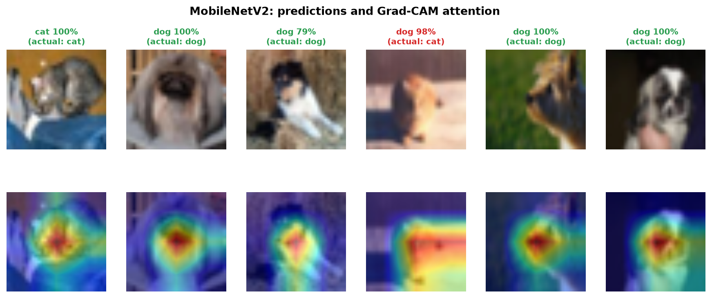

# 🐾 PetVision: Cat vs Dog Image Classifier

A CNN built from scratch races a fine-tuned **MobileNetV2** on real cat and dog photos. A Streamlit app lets you upload any photo, see both models vote, and use **Grad-CAM** to see what they looked at.

**Links:** [GitHub](https://github.com/Natkros/Image-Classification) · Live demo: run locally (see below)

## Results (2,000 held-out CIFAR-10 test photos)

| Model | Accuracy | F1 | Params | Train time | CPU latency |
| :-- | :-: | :-: | :-: | :-: | :-: |
| Custom CNN (from scratch) | 85.7% | 85.7% | 3.26M | 32 min | **6.4 ms** |
| MobileNetV2 (transfer) | **90.0%** | **90.0%** | **2.23M** | **8 min** | 15.4 ms |

Pretrained features give +4.4 points of accuracy for a quarter of the training time. The compact scratch CNN is faster per image on CPU. Details and charts are in the notebook and `Project_Report.pdf`.



## Quickstart

```bash
pip install -r requirements.txt
streamlit run app.py          # demo app
python train.py               # retrain both models (downloads CIFAR-10, ~170 MB, on first run)
python evaluate.py            # metrics + charts
python build_notebook.py      # re-execute the notebook
python generate_report.py     # rebuild the PDF
```

## Layout

| File | Purpose |
| :-- | :-- |
| `dataset.py` | CIFAR-10 cats/dogs, augmentation, train/val/test loaders |
| `model.py` | `CustomCNN` and MobileNetV2 head |
| `train.py` | AdamW + cosine LR, keeps best-validation checkpoint |
| `evaluate.py` | Test metrics, latency, all charts |
| `gradcam.py` | Grad-CAM heat maps |
| `app.py` | Streamlit app |

## Honest notes
- CIFAR-10 images are 32×32, so the models work best on close-ups of a single pet; a full-resolution dataset would score higher.
- Latency is the median single-image CPU time and varies by machine.

**Author:** Kritarth Saxena ([@Natkros](https://github.com/Natkros))
